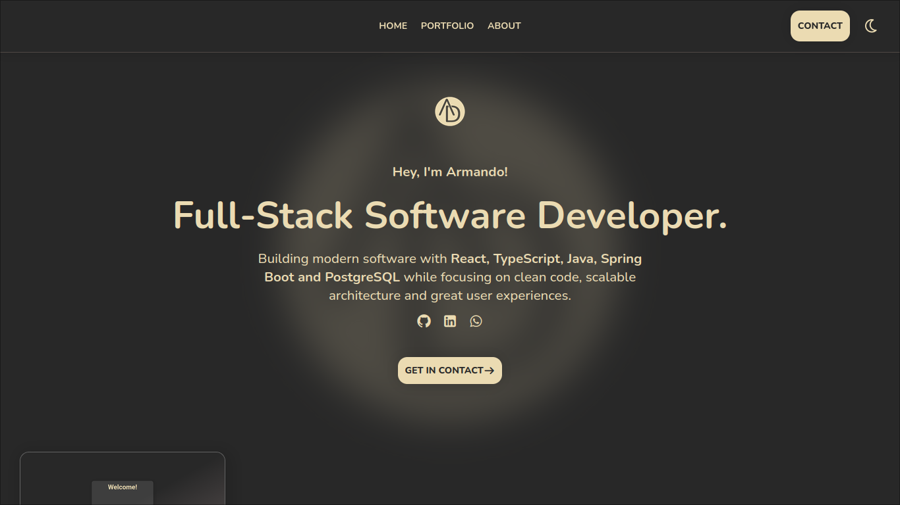
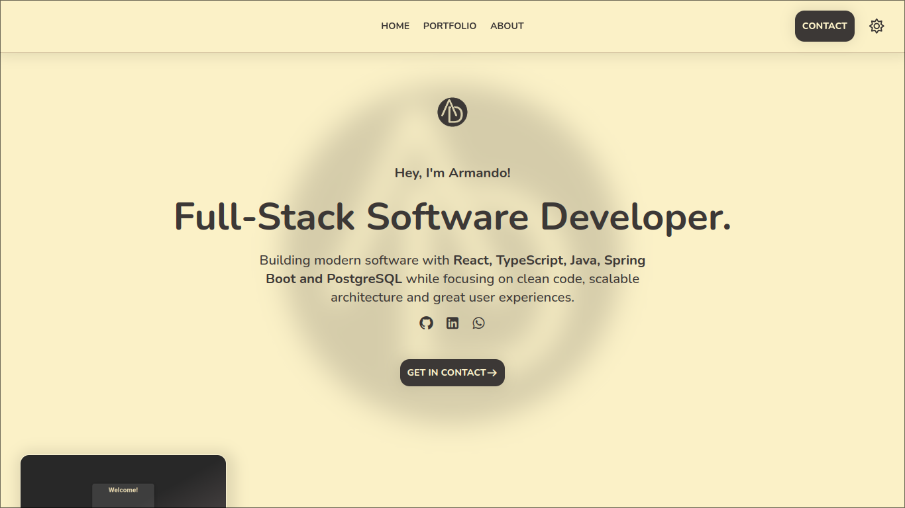
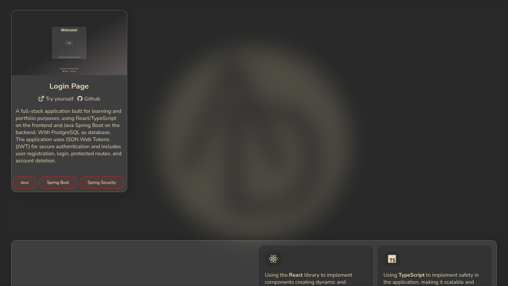
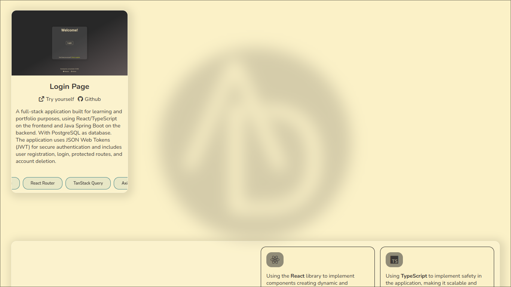
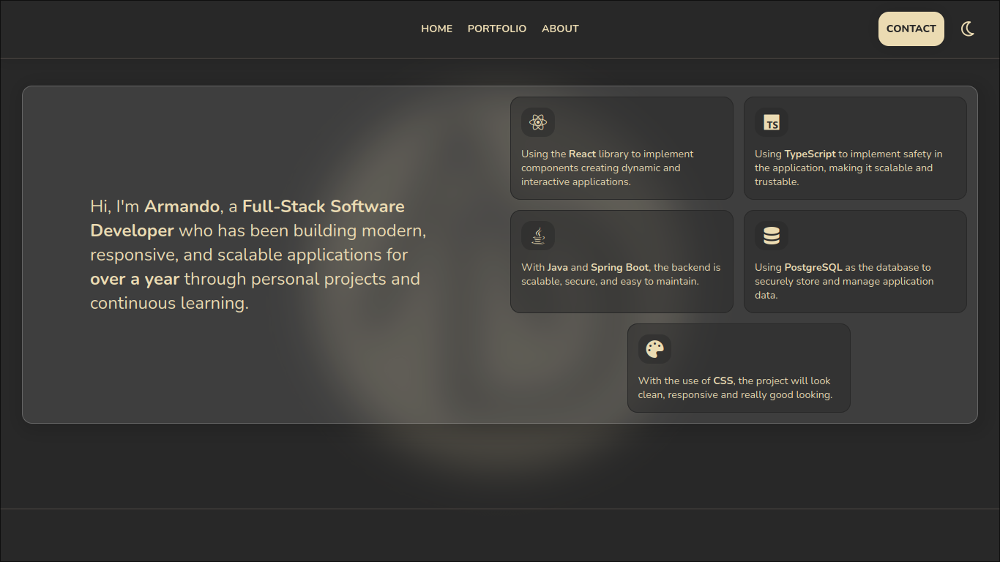
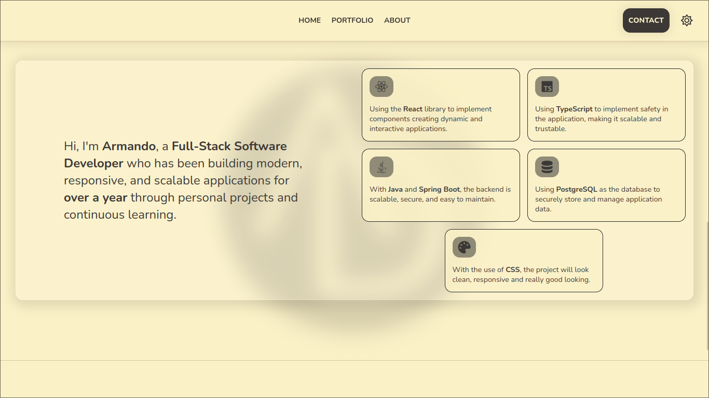
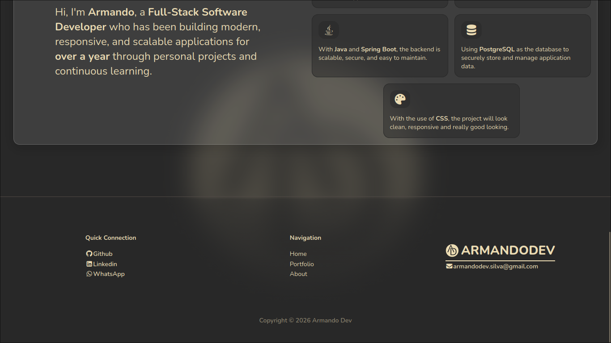
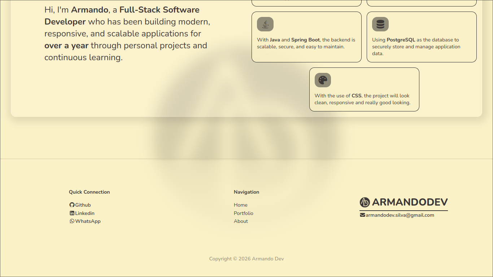

# Portfolio Website

A personal portfolio website built with React, TypeScript, and Vite to showcase my projects, skills, and experience.

## Live Demo

[-> Visite the Website <-](https://armandodev.com.br)

## Features

- Responsive design
- Dark mode
- Projects showcase
- Smooth animations

## Tech Stack

- React
- TypeScript
- Vite
- CSS3
- CSS Modules

## Preview

### Hero

### Portfolio

### About

### Footer

### Desktop

### Mobile

